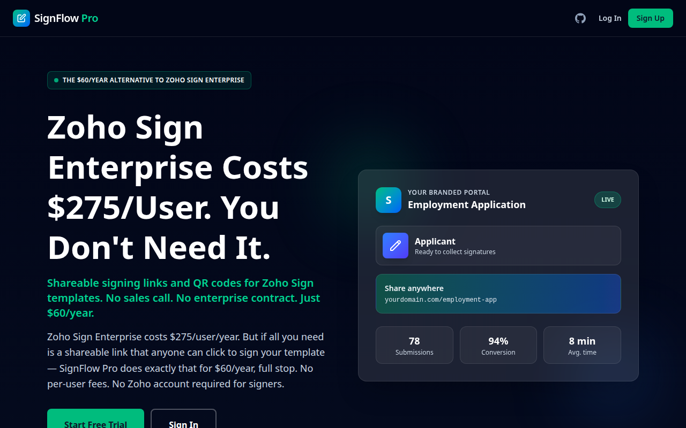

# SignFlow Pro



Turn any Zoho Sign template into a permanent, shareable URL or QR code. Signers click the link, enter their name and email, and sign — no Zoho account, no friction, no per-user fees.

**Live at [signflow.ink](https://signflow.ink)** · $60/year flat.

## Why this exists

Zoho Sign is powerful but built for the person *sending* documents, not the person *signing* them. Every signer needs a Zoho account, or you're manually emailing each one. For businesses that collect signatures from the public — waivers, intake forms, contracts — that friction kills conversion.

SignFlow sits in front of Zoho Sign and gives you a permanent link you can put on a website, a QR code on a counter, or an email. The signer never sees Zoho. They see your branded page, they sign, they're done.

## What it does

- **Permanent signing links** — one URL per template, works forever, unlimited signers
- **QR codes** — print-ready, generated automatically for each link
- **Branded landing pages** — your logo, your colors, your domain
- **Analytics** — visits, submissions, conversion rates per link
- **Multi-role support** — templates with multiple signers, each gets their own step
- **Stripe billing** — subscription management with webhook-idempotent handling

## How it's built

- **React 19 + TypeScript + Vite** — single-page app, no SSR needed
- **Vercel Edge Functions** — API routes for Zoho OAuth, Stripe webhooks, link management
- **Supabase** — auth, Postgres database, row-level security
- **Zoho Sign API** — multi-region OAuth, credentials stay server-side
- **Stripe** — signature verification + replay protection on webhooks

The interesting part is the Zoho OAuth flow — it handles multiple Zoho data regions (US, EU, IN, AU) with per-tenant credential storage, and the signing session is entirely server-mediated so credentials never reach the browser.

## Run it locally

```bash
npm install
cp .env.local.example .env.local   # Add your Zoho + Supabase + Stripe keys
npm run dev:full                    # Frontend on :5173, API on :3001
npm test                            # Vitest
```

## License

Proprietary. All rights reserved.
